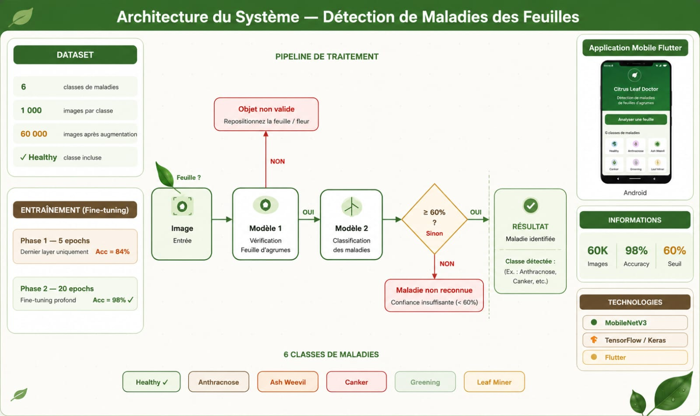

<h1 align="center">🍊 Citrus Leaf Disease Detection</h1>

<p align="center"> A computer vision project that detects diseases on citrus leaves from a photo, using two chained deep learning models instead of a single classifier.



## The idea

Most leaf disease classifiers assume the input is always a leaf, and will happily force any image — a person, a car, a random object — into one of their disease categories. We wanted something more reliable, so we split the problem into two steps:

1. **Is this actually a citrus leaf?** A binary model first checks whether the image shows a citrus leaf at all.
2. **If it is, what's wrong with it?** Only then does a second model decide whether the leaf is healthy or identify which disease it shows — and if it isn't confident enough in its answer, it says so instead of guessing.

This two-stage design means the system can confidently reject irrelevant images and avoid confidently-wrong disease predictions on unclear leaves.


## The two models

Both models are built on **MobileNetV3-Large** (pretrained on ImageNet), chosen for being lightweight while still accurate — a good fit for a model that should eventually run on modest hardware. For both, we froze the pretrained backbone and only fine-tuned the last few feature blocks plus the classifier head, which let us adapt the network to citrus leaves without losing the general visual features it already learned from ImageNet.

**Model 1 — Binary citrus leaf detector**
Decides `citrus_leaf` vs `not_citrus_leaf`. A single sigmoid output trained with binary cross-entropy.

**Model 2 — Disease classifier**
Decides between 6 classes: `Anthracnose`, `Ash weevil`, `Canker`, `Greening`, `Healthy`, and `Leaf miner`. A softmax output trained with cross-entropy and label smoothing. We iterated on this model twice — an initial baseline version, then an optimized version that unfreezes more of the backbone, trains for more epochs, and uses a heavier data augmentation recipe, which gave noticeably better generalization.

## The dataset

**Model 1 was trained on 120,000 images:**
- 60,000 images of citrus leaves
- 60,000 images of completely unrelated subjects — people, cars, animals, food, and other everyday objects — so the model learns a clean boundary between "citrus leaf" and "literally anything else"

**Model 2 was trained on 60,000 citrus leaf images**, spread across the 6 disease/health classes above. This is the same set of citrus leaf images used as the "citrus_leaf" half of Model 1's dataset.

Both totals were reached by augmenting a smaller set of original photos — generating flipped, rotated, brightness-adjusted, blurred, noised, cropped, and zoomed variants of each source image to multiply the dataset and make the models more robust to real-world variation in lighting, angle, and image quality. The final augmented dataset was then split into train/validation/test sets for training and evaluation.

## Project structure

```
Citrus-Leaf-Doctor/  
│  
├── citrus_leaf_app/                           # Application Flutter pour l'interface utilisateur  
│   │  
│   ├── android/                               # Configuration et code spécifique Android  
│   ├── assets/                                # Images, icônes et ressources utilisées par l'application  
│   ├── ios/                                   # Configuration et code spécifique iOS  
│   ├── lib/                                   # Code source principal Flutter (UI, logique métier, navigation)  
│   ├── linux/                                 # Configuration pour exécution sous Linux  
│   ├── macos/                                 # Configuration pour exécution sous macOS  
│   ├── test/                                  # Tests unitaires et tests de widgets Flutter  
│   ├── web/                                   # Configuration pour déploiement Web  
│   ├── windows/                               # Configuration pour exécution sous Windows  
│   │  
│   ├── .gitignore                             # Fichiers et dossiers ignorés par Git  
│   ├── .metadata                              # Métadonnées générées par Flutter  
│   ├── analysis_options.yaml                  # Règles d'analyse statique et de qualité du code  
│   ├── pubspec.lock                           # Versions exactes des dépendances installées  
│   ├── pubspec.yaml                           # Déclaration des dépendances et ressources Flutter  
│   └── README.md                              # Documentation de l'application Flutter  
│  
├── Dataset Scripts/                           # Scripts de préparation et prétraitement des données  
│   │  
│   ├── script_augmentation.py                 # Génération artificielle d'images (rotation, zoom, flip, etc.)  
│   ├── script_resize.py                       # Redimensionnement des images à la taille requise  
│   └── script_split.py                        # Séparation du dataset en ensembles Train/Validation/Test  
│  
├── Train notebooks/                           # Notebooks d'entraînement et d'évaluation des modèles  
│   │  
│   ├── Model 1/                               # Modèle de classification binaire  
│   │   │  
│   │   ├── best_citrus_binary_model.pth       # Poids du meilleur modèle binaire entraîné  
│   │   ├── Binary_Classifier.ipynb            # Notebook d'entraînement du classifieur binaire  
│   │   └── Test_citrus_binary.ipynb           # Notebook de test et d'évaluation du modèle binaire  
│   │  
│   └── Model 2/                               # Modèle de classification des maladies  
│       │  
│       ├── best_model_finetuned.pth           # Poids du modèle fine-tuné final  
│       ├── Disease_Classifier_optimized.ipynb # Version optimisée du notebook d'entraînement  
│       ├── Disease_Classifier.ipynb           # Notebook principal de classification des maladies  
│       └── Test_disease_classifier.ipynb      # Notebook d'évaluation du modèle de maladies  
│  
├── pipeline.jpeg                              # Schéma illustrant l'architecture complète du projet  
│  
└── README.md                                  # Documentation générale du projet Citrus Leaf Doctor  
```

## Result

The end result is a pipeline that takes any image, filters out anything that isn't a citrus leaf, and for genuine citrus leaves either names the disease, confirms the leaf is healthy, or honestly reports that it isn't sure — rather than forcing a confident-sounding but unreliable label onto every input.
